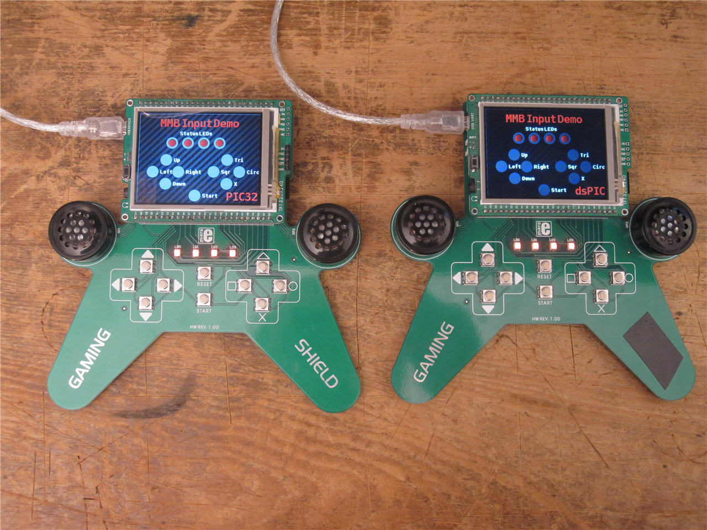
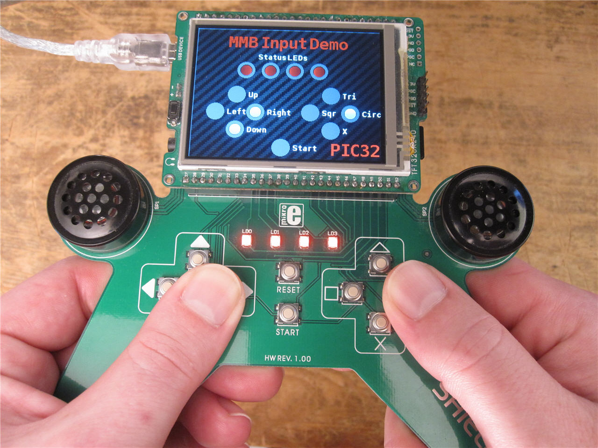
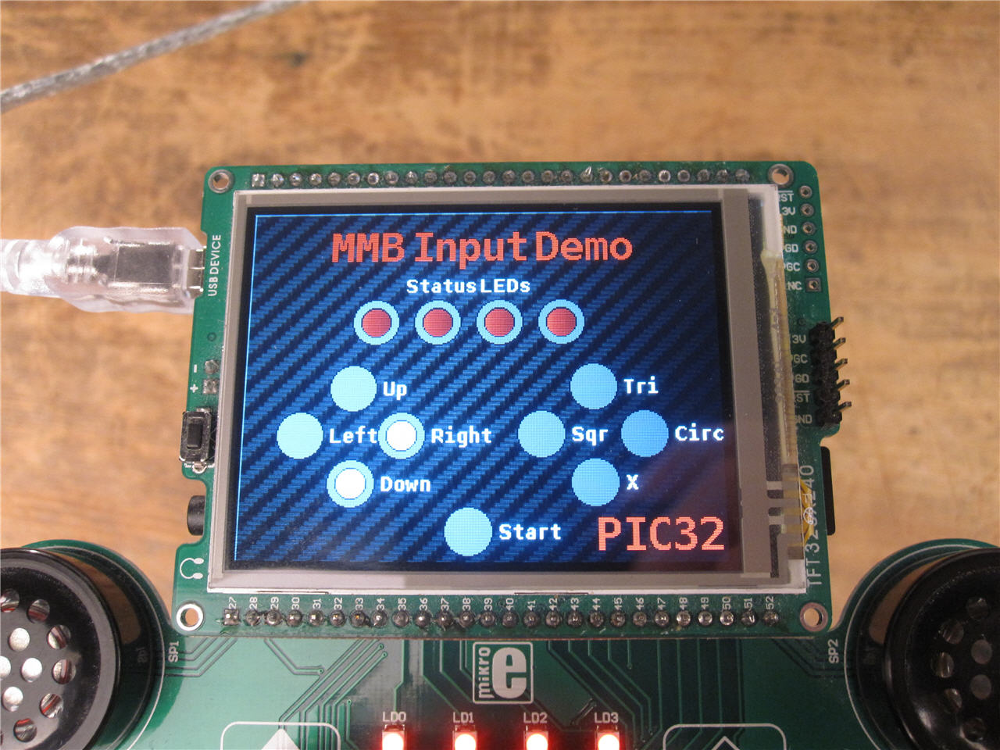

#Andrew Hazelden's Mikromedia Gaming Shield Library  
Version 0.2 Alpha - Dec 1, 2012  

This is an input library for the MikroElektronika Mikromedia Gaming Shield. It is compatible with the Mikromedia dsPIC33 and PIC32 boards. The library is designed to get you started with the Gaming Shield and provides control over the 4 LEDs on the Gaming Shield and reads the inputs from the buttons.

You can use the file "gaming-shield.h" in your projects to interface with your MMB Gaming Shield. The example Visual TFT project file "mmbInput.vtft" shows a demo of the Gaming Shield Input Library.

The code was written using [mikroC PRO for PIC32](http://www.mikroe.com/mikroc/pic32/), [mikroC PRO for dsPIC](http://www.mikroe.com/mikroc/dspic/), and [VisualTFT](http://www.mikroe.com/visualtft/).

* * * 

##Developer Note

This version of the library has added support for both the Mikromedia dsPIC33 v1.05 and v1.10 boards.

To enable support for the older v1.05 mikromedia board you need to comment out the following block of code from **line 62** of the gaming-shield.h file:

	//Comment out the next line to enable fallback support for the older Mikromedia dsPIC33 v1.05 board
	#define ENABLE_MMB_DSPIC33_110_SUPPORT

* * * 

##Installation

1. Install the HEX Firmware 

	Flash the firmware file **mmbInput-dsPIC33.hex** to your Mikromedia dsPIC33 board or the firmware file **mmbInput-PIC32.hex** to your Mikromedia PIC32 board.

2. Copy the VisualTFT resource file **mmbInput.RES** to your Mikromedia board's microSD card.

3. Get ready to try out the Gaming Shield Library!  
 
	You can press any of the buttons on the gaming shield and see the icons on the screen update. The status LED icons on the MMB touch screen will respond to your input and turn the gaming shield LEDs ON or OFF.
	
	The lower right part of the MMB screen will indicate the current microprocessor with the text "dsPIC" or "PIC32".

------------------------------------------------------

##Library Details

###Open Source Software License:  
[New BSD License](https://en.wikipedia.org/wiki/BSD_licenses)
  
###Compatible Software 
[mikroC PRO for PIC32](http://www.mikroe.com/mikroc/pic32/)
                 
[mikroC PRO for dsPIC](http://www.mikroe.com/mikroc/dspic/)

[VisualTFT](http://www.mikroe.com/visualtft/)

                
###Hardware Required
                
####Compatible Development Boards      
[MikroMMB for PIC32](http://www.mikroe.com/mikromedia/pic32/) or [MikroMMB for dsPIC33](http://www.mikroe.com/mikromedia/dspic33/)             

###Gaming Controller    
[Mikromedia GAMING Shield](http://www.mikroe.com/mikromedia/shields/gaming/)

------------------------------------------------------

Library Created by Andrew Hazelden. (c) copyright 2012.

Email: [andrewhazelden@gmail.com](mailto:andrewhazelden@gmail.com)
 
Blog:  [http://www.andrewhazelden.com](http://www.andrewhazelden.com)

